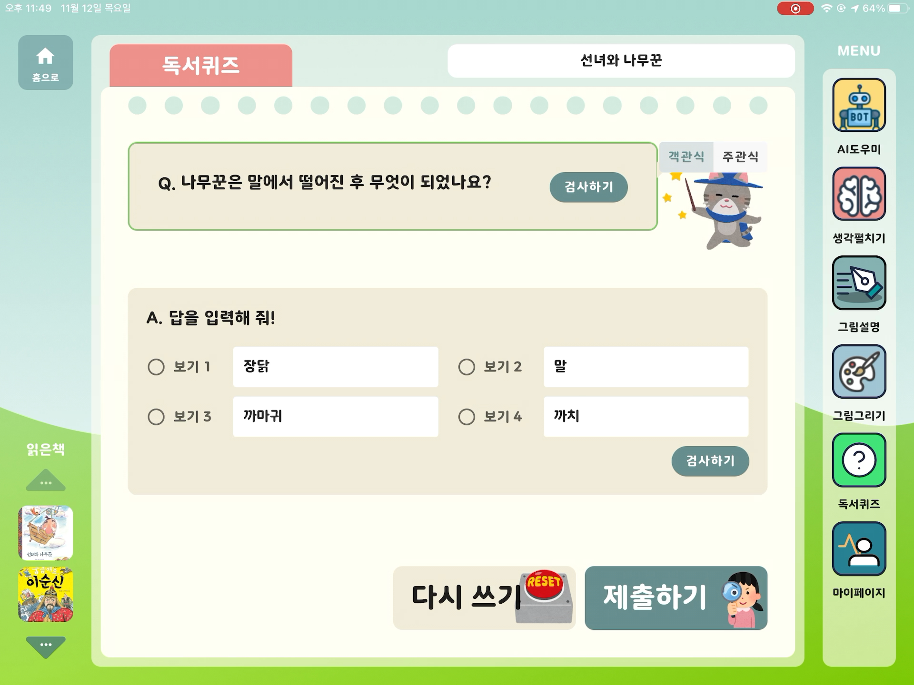

# 똑독 프론트엔드 애플리케이션

## 사용 프레임워크

- Vue.js 2.6.11

## 설치 및 실행방법

### 설치

```bash
npm install
```

### 실행

```bash
npm run serve
```

기본적으로 8080 포트에서 실행되며, 백엔드 서버가 같은 IP, 7002 포트에서 실행되고 있어야 합니다.
(devServer의 proxy 기능 사용)

포트, 또는 허용 ip를 바꾸고 싶은 경우 다음과 같이 실행하세요.

```bash
npm run serve -- --port <your-port> --ip <your-ip>
```

## 주요 기능 스크린샷

### 메인 화면


### 생각 펼치기


### 그림 그리기


### 그림 설명하기


### 독서 퀴즈



### 마이페이지

